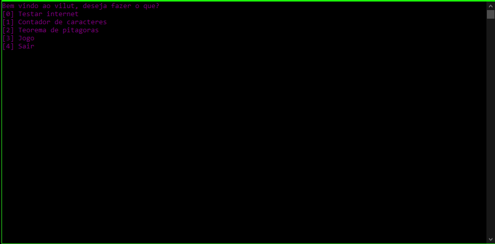

# Vilut

 Software básico criado para treinar linguagem C++

Criado por um *estudante* de programação.  

Vilut não tem *GUI*, e só funciona no *MSDOS* do windows.

Eu não testei em outros computadores, então não tenho certeza que funciona, se puder testar fico agradecido.

***

No Vilut você encontrará:

* Comando ping
* Contador de caractere
* Teorema de pitágoras
* Jogo

***

Imagem do Vilut.exe na página principal

